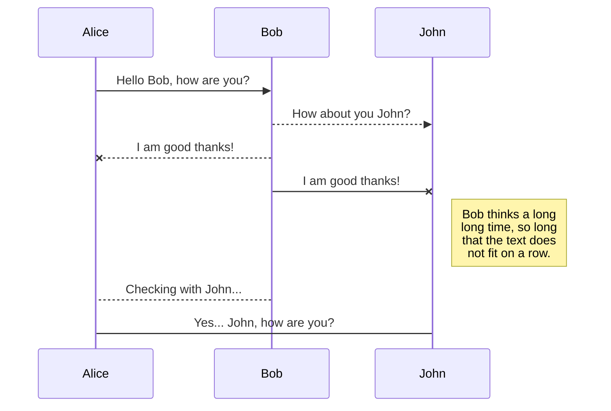
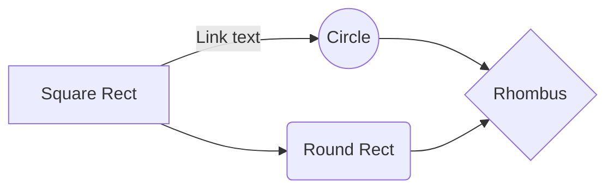

https://stackedit.io/app#

# Títol 1
Amb markdown es poden crear textes enriquits de manera molt senzilla.

Es poden crear diferents nivells de títols:
## Títol2
### Títol 3
...
###### Títol 6

 Pots fer **negreta** o *cursiva* o ***negreta i cursiva***.

Es poden fer llistes numerades:
1. item 1
2. item 2
3. item 3
4. ...
o no numerades

- item 1
- item 2 
- ...

Es poden fer cites:
>The only way to go fast, is to go well [Uncle Bob]

i crear links:
[Es Liceu](https://esliceu.com)

i moltes més coses:
**Taules**
|Nombre|Nombre romà|
|--|--|
|1|I|
|2|II|
|3|III|
|4|IV|

**Diagrames UML**

You can render UML diagrams using [Mermaid](https://mermaidjs.github.io/). For example, this will produce a sequence diagram:

And this will produce a flow chart:

També es poden fer fórmules matemàtiques.
